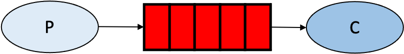
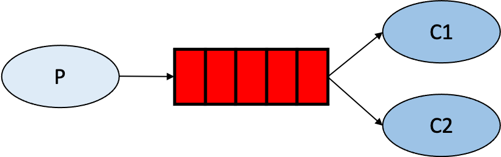
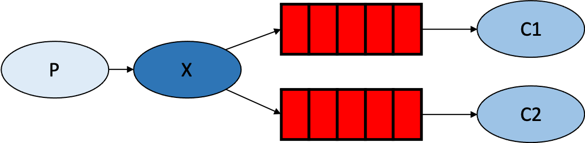
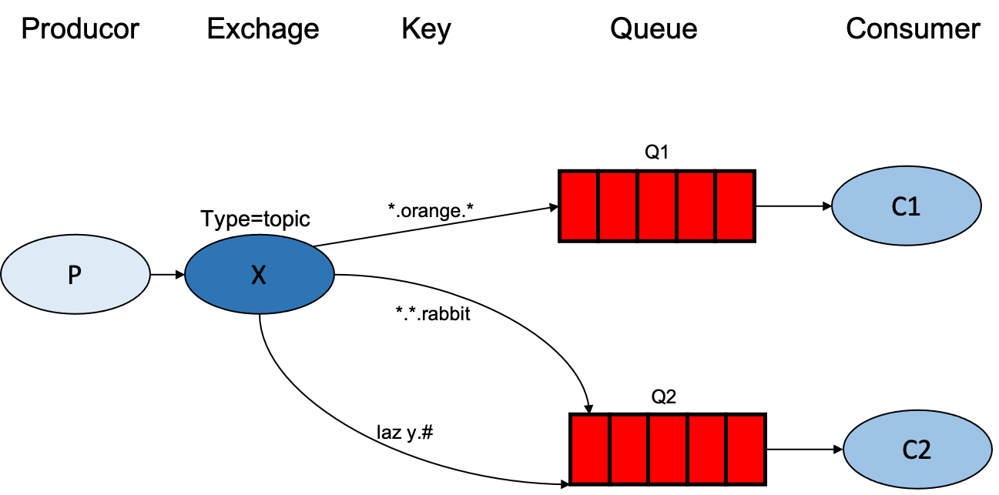

# rabbitmq_example

 several example for rabbitmq

## Simple pattern

The most commonly used pattern.

## Work pattern

A message can only be accessed by one consumer. Can play the role of load balancing.

## Publish/Subscribe pattern

Messages are routed to multiple queues and a message is fetched by multiple consumers.

## Routing pattern

A message can be fetched by multiple consumers and the destination queue for the message can be specified by the producer.

## Topic pattern

A message can be fetched by multiple consumers. The target queue of a message can be specified by BindingKey as a wildcard.(#:One or more words, *:One word)

